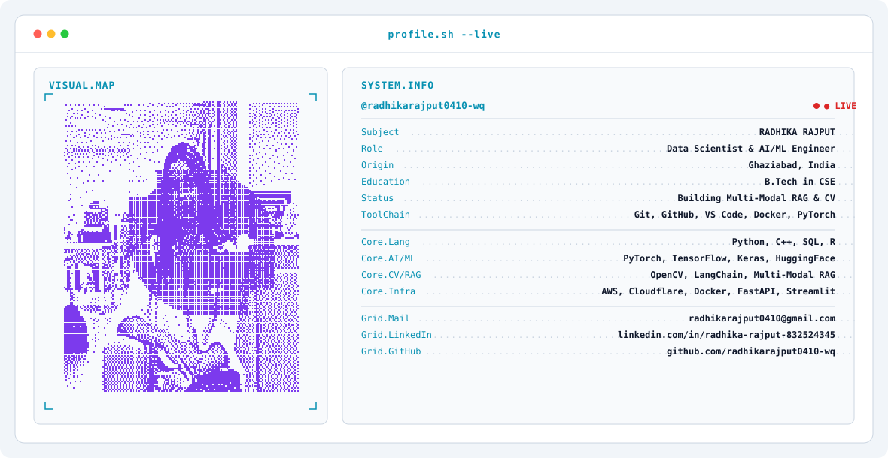

<!-- ========================================================================= -->
<!-- RADHIKA RAJPUT - ANIMATED TERMINAL + ABOUT ME + TECH STACK PROFILE -->
<!-- ========================================================================= -->

<!-- 1. Theme-Aware Animated Terminal Banner with Dithered Photo -->
<picture>
  <source media="(prefers-color-scheme: dark)" srcset="dark.svg">
  <source media="(prefers-color-scheme: light)" srcset="light.svg">
  
</picture>

  

<!-- 2. About Me Section -->
## 🚀 About Me

- 🧠 Strong foundation in **AI/ML & Data Science** (`Python`, `PyTorch`, `TensorFlow`, `Scikit-Learn`)
- 👁️ Building **Multi-Modal LLM RAG Engines** & **Real-time Computer Vision Pipelines**
- 🌱 Currently expanding **Generative AI & Autonomous Agentic Workflows**
- 🎯 Goal: **Data Scientist / AI & ML Engineering Roles**

 

<!-- 3. Tech Stack Section -->
## 🛠️ Tech Stack

### 👨‍💻 Languages

  
  
  
  

### ⚙️ AI & Machine Learning

  
  
  
  
  
  

### 📊 Data Science & Analytics

  
  
  
  
  

### ☁️ MLOps & Infrastructure

  
  
  
  
  

 

<!-- 4. GitHub Stats Section -->
## 📊 GitHub Analytics

  
    
  
  

 

<!-- 5. Contribution Snake Matrix -->
## 🐍 Contribution Graph

  <picture>
    <source media="(prefers-color-scheme: dark)" srcset="https://raw.githubusercontent.com/radhikarajput0410-wq/radhikarajput0410-wq/output/github-snake-dark.svg" />
    <source media="(prefers-color-scheme: light)" srcset="https://raw.githubusercontent.com/radhikarajput0410-wq/radhikarajput0410-wq/output/github-snake.svg" />
    
  </picture>

 

<!-- 6. Social Connect Badges -->

  
  &nbsp;&nbsp;
  
  &nbsp;&nbsp;
  
  &nbsp;&nbsp;
  

